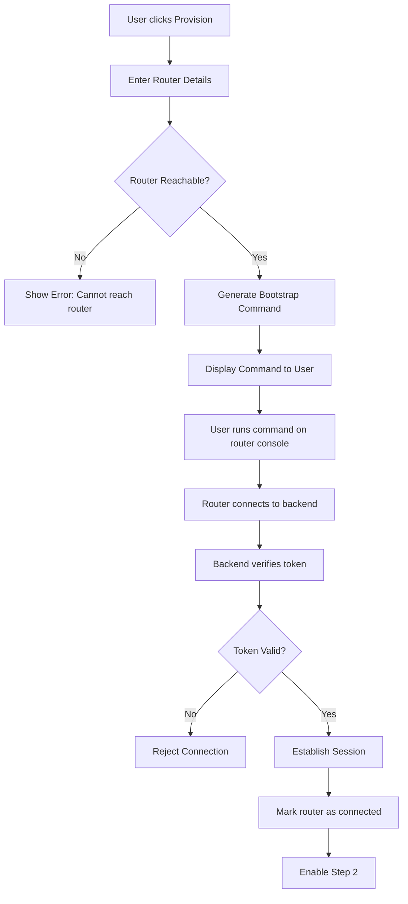
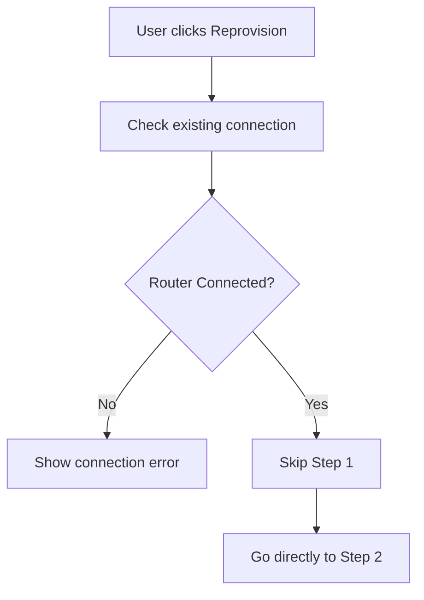
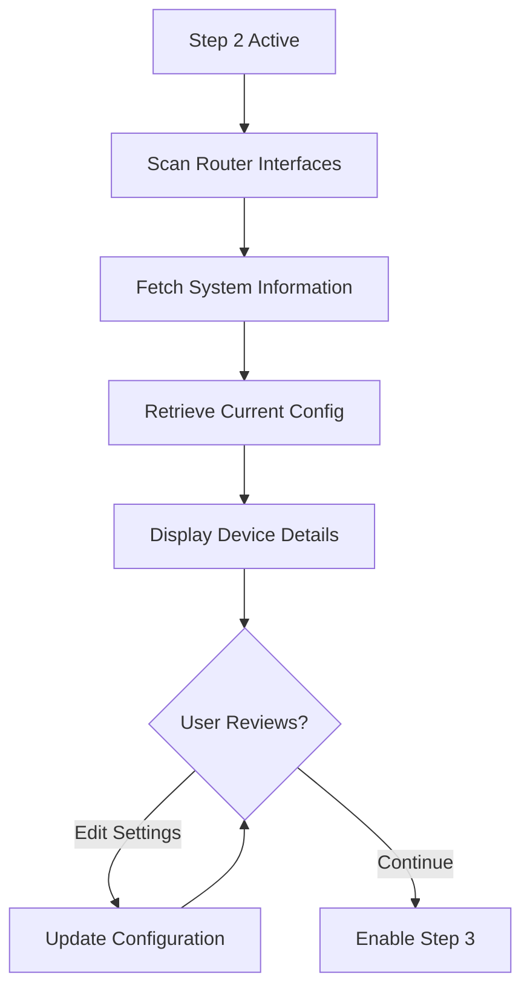
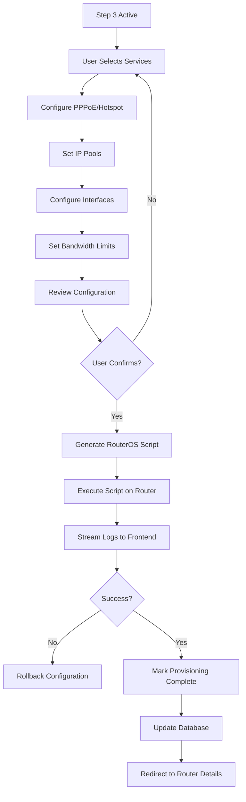

# MikroTik Router Provisioning - Complete Technical Guide

## Table of Contents
1. [Introduction](#introduction)
2. [Architecture Overview](#architecture-overview)
3. [Provisioning Workflow](#provisioning-workflow)
4. [Technical Implementation](#technical-implementation)
5. [Command Generation](#command-generation)
6. [Script Execution](#script-execution)
7. [Device Communication](#device-communication)
8. [Network Configuration](#network-configuration)
9. [Security Implementation](#security-implementation)
10. [Error Handling & Recovery](#error-handling--recovery)
11. [Live Log Streaming](#live-log-streaming)
12. [Reprovisioning](#reprovisioning)
13. [Best Practices](#best-practices)
14. [Troubleshooting](#troubleshooting)

---

## Introduction

This guide explains in detail how the Codevertex ISP Billing System provisions MikroTik routers, from the initial connection to the final service configuration. Understanding this process is crucial for system administrators, developers, and technical support staff.

### What is Router Provisioning?

Router provisioning is the automated process of:
1. Establishing connection to a MikroTik router
2. Configuring network interfaces
3. Setting up PPPoE/Hotspot services
4. Creating user pools and IP assignments
5. Implementing bandwidth management
6. Establishing monitoring and management

### Why Automated Provisioning?

**Manual Configuration Issues**:
- ❌ Time-consuming (30+ minutes per router)
- ❌ Error-prone
- ❌ Inconsistent configurations
- ❌ Difficult to scale
- ❌ No audit trail

**Automated Provisioning Benefits**:
- ✅ Fast (< 5 minutes per router)
- ✅ Consistent and reliable
- ✅ Scalable to hundreds of routers
- ✅ Complete audit trail
- ✅ Rollback capability
- ✅ Version control

---

## Architecture Overview

### System Components

```
┌─────────────────────────────────────────────────────────────┐
│                    Frontend (Next.js)                        │
│  ┌─────────────────────────────────────────────────────┐   │
│  │   Provisioning Wizard (3 Steps)                     │   │
│  │   ├── Step 1: Connection Setup                      │   │
│  │   ├── Step 2: Device Details                        │   │
│  │   └── Step 3: Service Configuration                 │   │
│  └─────────────────────────────────────────────────────┘   │
└────────────────────┬────────────────────────────────────────┘
                     │ HTTP/WebSocket
┌────────────────────▼────────────────────────────────────────┐
│               Backend API (FastAPI)                          │
│  ┌──────────────┐  ┌────────────────┐  ┌───────────────┐  │
│  │ Provisioning │  │  Command       │  │   Session     │  │
│  │   Service    │  │  Generator     │  │   Manager     │  │
│  └──────┬───────┘  └────────┬───────┘  └───────┬───────┘  │
└─────────┼──────────────────┼───────────────────┼──────────┘
          │                  │                   │
          ▼                  ▼                   ▼
┌─────────────────────────────────────────────────────────────┐
│                 MikroTik RouterOS API                        │
│  ┌──────────────┐  ┌────────────────┐  ┌───────────────┐  │
│  │   API Port   │  │   Script       │  │  Interface    │  │
│  │   (8728)     │  │   Execution    │  │  Discovery    │  │
│  └──────────────┘  └────────────────┘  └───────────────┘  │
└─────────────────────────────────────────────────────────────┘
```

### Data Flow

```
User Action → Frontend → Backend API → Database
                ↓            ↓
          WebSocket    RouterOS API
          Updates      Commands
                ↓            ↓
          Live Logs    Configuration
```

---

## Provisioning Workflow

### Complete 3-Step Process

#### **Step 1: Connection Setup**

**First-Time Provisioning**:


**Reprovisioning**:


#### **Step 2: Device Details**



#### **Step 3: Service Configuration**



---

## Technical Implementation

### 1. Backend Service Architecture

#### Provisioning Service (`app/services/provisioning_service.py`)

```python
class ProvisioningService:
    """
    Handles all provisioning operations.
    
    Responsibilities:
    - Session management
    - Command generation
    - Script execution
    - Error handling
    - Log streaming
    """
    
    def __init__(self, db: Session):
        self.db = db
        self.sessions = {}  # Active provisioning sessions
        self.log_streams = {}  # WebSocket connections for logs
    
    async def create_provisioning_session(
        self, 
        router_id: int, 
        user_id: int
    ) -> ProvisioningSession:
        """
        Create a new provisioning session.
        
        Process:
        1. Validate router exists and is accessible
        2. Generate unique session token
        3. Create session in database
        4. Initialize WebSocket for logs
        5. Return session details
        """
        # Validate router
        router = self.db.query(Router).filter(Router.id == router_id).first()
        if not router:
            raise ResourceNotFoundError(f"Router {router_id} not found")
        
        # Generate secure token
        token = self._generate_session_token(router_id, user_id)
        
        # Create session
        session = ProvisioningSession(
            router_id=router_id,
            user_id=user_id,
            token=token,
            status=ProvisioningStatus.PENDING,
            step=ProvisioningStep.CONNECTION,
            created_at=datetime.utcnow()
        )
        
        self.db.add(session)
        self.db.commit()
        
        # Store in memory for quick access
        self.sessions[token] = session
        
        return session
    
    def _generate_session_token(self, router_id: int, user_id: int) -> str:
        """
        Generate cryptographically secure session token.
        
        Token Format: BASE64(AES_ENCRYPT(router_id|user_id|timestamp|random))
        
        Security:
        - Uses AES-256 encryption
        - Includes timestamp to prevent replay attacks
        - Adds random bytes for uniqueness
        - 24-hour expiry
        """
        import secrets
        from cryptography.fernet import Fernet
        
        # Get encryption key from environment
        key = settings.ENCRYPTION_KEY.encode()
        cipher = Fernet(key)
        
        # Create token payload
        timestamp = int(datetime.utcnow().timestamp())
        random_bytes = secrets.token_hex(16)
        payload = f"{router_id}|{user_id}|{timestamp}|{random_bytes}"
        
        # Encrypt and encode
        encrypted = cipher.encrypt(payload.encode())
        token = base64.urlsafe_b64encode(encrypted).decode()
        
        return token
```

### 2. Command Generation

#### Bootstrap Command Generation

The bootstrap command is what the user runs on the MikroTik console to establish initial connection.

```python
def generate_bootstrap_command(self, session_id: int, domain: str) -> str:
    """
    Generate the bootstrap command for router provisioning.
    
    Command Structure:
    /tool fetch mode=https url="<provisioning_url>" dst-path=provision.rsc;:delay 2s;/import provision.rsc;
    
    Explanation:
    1. /tool fetch - MikroTik command to download files
    2. mode=https - Use HTTPS for security
    3. url="..." - The provisioning endpoint URL
    4. dst-path=provision.rsc - Save as provision.rsc
    5. :delay 2s - Wait 2 seconds for download to complete
    6. /import provision.rsc - Execute the downloaded script
    
    The URL contains the encrypted session token for authentication.
    """
    session = self.get_session(session_id)
    
    # Build provisioning URL with token
    provisioning_url = (
        f"https://{domain}/api/v1/provisioning/"
        f"bootstrap/{session.token}"
    )
    
    # Generate the command
    command = (
        f'/tool fetch mode=https url="{provisioning_url}" '
        f'dst-path=provision.rsc;'
        f':delay 2s;'
        f'/import provision.rsc;'
    )
    
    return command
```

**Why This Approach?**

1. **Security**: HTTPS ensures encrypted communication
2. **Token Authentication**: Session token validates the request
3. **Single Command**: User only needs to paste one line
4. **Automatic Execution**: Script imports and runs automatically
5. **Error Recovery**: If download fails, nothing is imported

#### Provisioning Script Generation

The provisioning script (provision.rsc) is dynamically generated based on router configuration:

```python
def generate_provisioning_script(
    self,
    router_id: int,
    config: ProvisioningConfig
) -> str:
    """
    Generate the complete RouterOS script for provisioning.
    
    Script Sections:
    1. System Identity
    2. Network Interfaces
    3. IP Addresses
    4. IP Pools
    5. PPPoE Server (if enabled)
    6. Hotspot Server (if enabled)
    7. Firewall Rules
    8. NAT Rules
    9. Queue Trees (Bandwidth Management)
    10. User Profiles
    11. Monitoring Setup
    
    Each section is generated separately and combined.
    """
    router = self.db.query(Router).filter(Router.id == router_id).first()
    
    script_parts = []
    
    # 1. System Identity
    script_parts.append(self._generate_identity_config(router, config))
    
    # 2. Network Interfaces
    script_parts.append(self._generate_interface_config(config))
    
    # 3. IP Configuration
    script_parts.append(self._generate_ip_config(config))
    
    # 4. IP Pools
    script_parts.append(self._generate_pool_config(config))
    
    # 5. PPPoE Server
    if config.enable_pppoe:
        script_parts.append(self._generate_pppoe_config(config))
    
    # 6. Hotspot Server
    if config.enable_hotspot:
        script_parts.append(self._generate_hotspot_config(config))
    
    # 7. Firewall Rules
    script_parts.append(self._generate_firewall_config(config))
    
    # 8. NAT Rules
    script_parts.append(self._generate_nat_config(config))
    
    # 9. Bandwidth Management
    script_parts.append(self._generate_queue_config(config))
    
    # 10. Monitoring
    script_parts.append(self._generate_monitoring_config(router))
    
    # Combine all parts
    script = "\n\n".join(script_parts)
    
    return script

def _generate_identity_config(self, router: Router, config: ProvisioningConfig) -> str:
    """
    Generate system identity configuration.
    
    Sets:
    - Router name/identity
    - Contact information
    - Location
    """
    return f"""
# ============================================
# SYSTEM IDENTITY
# ============================================
/system identity set name="{config.router_identity}"
/system note set note="Provisioned by Codevertex ISP Billing System"
/system note set show-at-login=yes
"""

def _generate_interface_config(self, config: ProvisioningConfig) -> str:
    """
    Configure network interfaces.
    
    Sets:
    - Bridge creation
    - Interface assignments to bridge
    - Interface descriptions
    """
    # Create bridge
    script = """
# ============================================
# NETWORK INTERFACES
# ============================================
# Create bridge
/interface bridge add name=bridge-local comment="LAN Bridge"
"""
    
    # Add ports to bridge
    for port in config.bridge_ports:
        script += f'/interface bridge port add bridge=bridge-local interface={port}\n'
    
    # Set interface descriptions
    script += f'/interface set ether1 comment="WAN - Internet"\n'
    script += f'/interface set bridge-local comment="LAN - Local Network"\n'
    
    return script

def _generate_ip_config(self, config: ProvisioningConfig) -> str:
    """
    Configure IP addresses and routing.
    
    Sets:
    - WAN IP (DHCP client or static)
    - LAN IP (gateway address)
    - DNS servers
    - Default route
    """
    script = """
# ============================================
# IP CONFIGURATION
# ============================================
"""
    
    # WAN Configuration
    if config.wan_dhcp:
        script += '/ip dhcp-client add interface=ether1 disabled=no\n'
    else:
        script += f'''
/ip address add address={config.wan_ip}/{config.wan_netmask} \\
    interface=ether1 comment="WAN IP"
/ip route add gateway={config.wan_gateway}
'''
    
    # LAN Configuration
    script += f'''
/ip address add address={config.gateway_ip}/{config.cidr} \\
    interface=bridge-local comment="LAN Gateway"
'''
    
    # DNS Configuration
    script += f'/ip dns set servers={config.dns_primary},{config.dns_secondary}\n'
    script += '/ip dns set allow-remote-requests=yes\n'
    
    return script

def _generate_pool_config(self, config: ProvisioningConfig) -> str:
    """
    Create IP address pools for client assignments.
    
    Pools:
    - PPPoE Pool: For PPPoE clients
    - Hotspot Pool: For Hotspot users
    - Static Pool: For static assignments
    
    Pool Calculation:
    Based on network address and CIDR, calculate usable IP range
    and split into pools.
    """
    script = """
# ============================================
# IP POOLS
# ============================================
"""
    
    # Calculate IP ranges
    network = ipaddress.ip_network(f"{config.subnet_address}/{config.cidr}", strict=False)
    usable_ips = list(network.hosts())
    
    # Reserve first IPs for gateway and infrastructure
    gateway_ip = usable_ips[0]  # Already used as gateway
    
    # PPPoE Pool: 50% of available IPs
    pppoe_start = usable_ips[10]
    pppoe_end = usable_ips[len(usable_ips) // 2]
    
    # Hotspot Pool: Remaining IPs
    hotspot_start = usable_ips[(len(usable_ips) // 2) + 1]
    hotspot_end = usable_ips[-10]  # Reserve last 10 IPs
    
    script += f'/ip pool add name=pppoe-pool ranges={pppoe_start}-{pppoe_end}\n'
    script += f'/ip pool add name=hotspot-pool ranges={hotspot_start}-{hotspot_end}\n'
    
    return script

def _generate_pppoe_config(self, config: ProvisioningConfig) -> str:
    """
    Configure PPPoE server.
    
    Sets:
    - PPPoE server on bridge interface
    - Default profile
    - Service name
    - Authentication method
    - IP pool assignment
    """
    script = """
# ============================================
# PPPoE SERVER
# ============================================
# Create PPPoE profile
/ppp profile add name=pppoe-profile \\
    local-address={gateway_ip} \\
    remote-address=pppoe-pool \\
    use-compression=no \\
    use-encryption=no \\
    only-one=yes \\
    comment="Default PPPoE Profile"

# Enable PPPoE server
/interface pppoe-server server add \\
    service-name="ISP-PPPoE" \\
    interface=bridge-local \\
    default-profile=pppoe-profile \\
    authentication=pap,chap,mschap1,mschap2 \\
    keepalive-timeout=60 \\
    disabled=no
""".format(gateway_ip=config.gateway_ip)
    
    return script

def _generate_hotspot_config(self, config: ProvisioningConfig) -> str:
    """
    Configure Hotspot server.
    
    Process:
    1. Create hotspot pool
    2. Create hotspot profile
    3. Create hotspot server
    4. Configure login page
    5. Set up walled garden (bypass URLs)
    """
    script = """
# ============================================
# HOTSPOT SERVER
# ============================================
# Create Hotspot profile
/ip hotspot profile add name=hotspot-profile \\
    hotspot-address={gateway_ip} \\
    dns-name="hotspot.local" \\
    html-directory=hotspot \\
    login-by=http-chap \\
    use-radius=no

# Create Hotspot server
/ip hotspot add name=hotspot1 \\
    interface=bridge-local \\
    address-pool=hotspot-pool \\
    profile=hotspot-profile \\
    disabled=no

# DHCP Server for Hotspot
/ip dhcp-server add name=hotspot-dhcp \\
    interface=bridge-local \\
    address-pool=hotspot-pool \\
    disabled=no

/ip dhcp-server network add \\
    address={network}/{cidr} \\
    gateway={gateway_ip} \\
    dns-server={dns_primary},{dns_secondary}
""".format(
        gateway_ip=config.gateway_ip,
        network=config.subnet_address,
        cidr=config.cidr,
        dns_primary=config.dns_primary,
        dns_secondary=config.dns_secondary
    )
    
    # Walled Garden (bypass URLs)
    if config.walled_garden_urls:
        script += "\n# Walled Garden\n"
        for url in config.walled_garden_urls:
            script += f'/ip hotspot walled-garden add dst-host={url}\n'
    
    return script

def _generate_firewall_config(self, config: ProvisioningConfig) -> str:
    """
    Configure firewall rules for security.
    
    Rules:
    1. Accept established/related connections
    2. Accept ICMP (ping)
    3. Drop invalid connections
    4. Accept connections to router from LAN
    5. Drop all other input
    6. Accept forwarding for LAN to WAN
    7. Drop forwarding from WAN to LAN (except established)
    """
    script = """
# ============================================
# FIREWALL RULES
# ============================================
# Input Chain
/ip firewall filter add chain=input connection-state=established,related \\
    action=accept comment="Accept established/related"
    
/ip firewall filter add chain=input connection-state=invalid \\
    action=drop comment="Drop invalid"
    
/ip firewall filter add chain=input protocol=icmp \\
    action=accept comment="Accept ICMP"
    
/ip firewall filter add chain=input in-interface=bridge-local \\
    action=accept comment="Accept from LAN"
    
/ip firewall filter add chain=input \\
    action=drop comment="Drop all other input"

# Forward Chain
/ip firewall filter add chain=forward connection-state=established,related \\
    action=accept comment="Accept established/related"
    
/ip firewall filter add chain=forward connection-state=invalid \\
    action=drop comment="Drop invalid"
    
/ip firewall filter add chain=forward in-interface=bridge-local \\
    out-interface=ether1 action=accept comment="LAN to WAN"
    
/ip firewall filter add chain=forward \\
    action=drop comment="Drop all other forward"
"""
    
    return script

def _generate_nat_config(self, config: ProvisioningConfig) -> str:
    """
    Configure NAT (Network Address Translation).
    
    Rules:
    - Masquerade outgoing connections (source NAT)
    - Port forwarding (if specified)
    """
    script = """
# ============================================
# NAT RULES
# ============================================
# Source NAT (Masquerade)
/ip firewall nat add chain=srcnat out-interface=ether1 \\
    action=masquerade comment="Masquerade LAN to WAN"
"""
    
    # Port forwarding rules
    if config.port_forwards:
        script += "\n# Port Forwarding\n"
        for forward in config.port_forwards:
            script += f'''
/ip firewall nat add chain=dstnat \\
    dst-port={forward['external_port']} \\
    protocol={forward['protocol']} \\
    in-interface=ether1 \\
    action=dst-nat \\
    to-addresses={forward['internal_ip']} \\
    to-ports={forward['internal_port']} \\
    comment="{forward['description']}"
'''
    
    return script

def _generate_queue_config(self, config: ProvisioningConfig) -> str:
    """
    Configure bandwidth management (QoS).
    
    Creates:
    - Queue trees for upload/download limiting
    - Simple queues for per-user limits
    - PCQ (Per Connection Queue) for fair sharing
    """
    script = """
# ============================================
# BANDWIDTH MANAGEMENT
# ============================================
# PCQ Types
/queue type add name=pcq-download kind=pcq pcq-rate=0 \\
    pcq-classifier=dst-address

/queue type add name=pcq-upload kind=pcq pcq-rate=0 \\
    pcq-classifier=src-address

# Queue Trees
/queue tree add name=download parent=bridge-local \\
    packet-mark=all-packets queue=pcq-download

/queue tree add name=upload parent=ether1 \\
    packet-mark=all-packets queue=pcq-upload
"""
    
    return script

def _generate_monitoring_config(self, router: Router) -> str:
    """
    Configure monitoring and management.
    
    Sets:
    - SNMP for monitoring
    - Logging to remote syslog server
    - API access for management
    - Backup schedule
    """
    script = f"""
# ============================================
# MONITORING & MANAGEMENT
# ============================================
# Enable API
/ip service enable api
/ip service set api port=8728

# SNMP Configuration
/snmp set enabled=yes contact="{router.contact_info}" \\
    location="{router.location}"

# Logging
/system logging action add name=remote target=remote \\
    remote={settings.SYSLOG_SERVER} remote-port=514

# Backup Schedule
/system scheduler add name=daily-backup \\
    on-event="/system backup save name=daily-backup" \\
    start-time=02:00:00 interval=1d
"""
    
    return script
```

### 3. Script Execution

#### Executing RouterOS Commands

```python
async def execute_provisioning_script(
    self,
    router_id: int,
    script: str,
    session_id: int
) -> bool:
    """
    Execute provisioning script on MikroTik router.
    
    Process:
    1. Connect to router via API
    2. Split script into commands
    3. Execute commands sequentially
    4. Log each command result
    5. Handle errors gracefully
    6. Stream logs to frontend via WebSocket
    """
    router = self.db.query(Router).filter(Router.id == router_id).first()
    session = self.get_session(session_id)
    
    try:
        # Connect to router
        api = self._connect_to_router(router)
        
        # Split script into commands
        commands = self._parse_script(script)
        
        # Execute commands
        for i, command in enumerate(commands):
            try:
                # Log start
                await self._stream_log(
                    session_id,
                    f"[{i+1}/{len(commands)}] Executing: {command[:50]}..."
                )
                
                # Execute command
                result = api.talk([command])
                
                # Log success
                await self._stream_log(
                    session_id,
                    f"[{i+1}/{len(commands)}] ✓ Success"
                )
                
            except Exception as cmd_error:
                # Log error
                await self._stream_log(
                    session_id,
                    f"[{i+1}/{len(commands)}] ✗ Error: {str(cmd_error)}"
                )
                
                # Rollback on critical error
                if self._is_critical_error(cmd_error):
                    await self.rollback_provisioning(session_id)
                    raise ProvisioningError(f"Critical error: {str(cmd_error)}")
        
        # Mark success
        session.status = ProvisioningStatus.COMPLETED
        session.completed_at = datetime.utcnow()
        self.db.commit()
        
        await self._stream_log(session_id, "✓ Provisioning completed successfully!")
        
        return True
        
    except Exception as e:
        # Mark failed
        session.status = ProvisioningStatus.FAILED
        session.error_message = str(e)
        self.db.commit()
        
        await self._stream_log(session_id, f"✗ Provisioning failed: {str(e)}")
        
        return False
    
    finally:
        # Disconnect
        if api:
            api.disconnect()

def _connect_to_router(self, router: Router) -> RouterOsApiPool:
    """
    Establish connection to MikroTik router via API.
    
    Uses:
    - RouterOS API (port 8728)
    - SSL/TLS encryption (port 8729 if available)
    - Authentication with stored credentials
    """
    from librouteros import connect
    from librouteros.login import login_plain, login_token
    
    try:
        # Try secure connection first
        try:
            api = connect(
                host=router.ip_address,
                username=router.username,
                password=router.password,
                port=8729,
                ssl_wrapper=ssl.wrap_socket,
                timeout=30
            )
        except:
            # Fall back to non-secure
            api = connect(
                host=router.ip_address,
                username=router.username,
                password=router.password,
                port=router.api_port or 8728,
                timeout=30
            )
        
        return api
        
    except Exception as e:
        raise RouterConnectionError(f"Failed to connect to router: {str(e)}")
```

---

## Live Log Streaming

### WebSocket Implementation

```python
# Backend WebSocket Handler
from fastapi import WebSocket

class ProvisioningWebSocket:
    """
    Handle WebSocket connections for live log streaming.
    """
    
    def __init__(self):
        self.active_connections: Dict[int, List[WebSocket]] = {}
    
    async def connect(self, session_id: int, websocket: WebSocket):
        """Accept WebSocket connection for a provisioning session."""
        await websocket.accept()
        
        if session_id not in self.active_connections:
            self.active_connections[session_id] = []
        
        self.active_connections[session_id].append(websocket)
    
    async def disconnect(self, session_id: int, websocket: WebSocket):
        """Remove WebSocket connection."""
        if session_id in self.active_connections:
            self.active_connections[session_id].remove(websocket)
    
    async def send_log(self, session_id: int, message: str):
        """Send log message to all connected clients."""
        if session_id in self.active_connections:
            for connection in self.active_connections[session_id]:
                try:
                    await connection.send_json({
                        'type': 'log',
                        'message': message,
                        'timestamp': datetime.utcnow().isoformat()
                    })
                except:
                    # Connection closed, remove it
                    await self.disconnect(session_id, connection)

# FastAPI Endpoint
@router.websocket("/ws/provisioning/{session_id}")
async def provisioning_websocket(
    websocket: WebSocket,
    session_id: int
):
    """WebSocket endpoint for provisioning logs."""
    await ws_manager.connect(session_id, websocket)
    
    try:
        while True:
            # Keep connection alive
            await websocket.receive_text()
    except WebSocketDisconnect:
        await ws_manager.disconnect(session_id, websocket)
```

### Frontend WebSocket Client

```typescript
// lib/store/provisioning.ts
export const useProvisioningStore = create<ProvisioningState>((set, get) => ({
  logs: [],
  isConnected: false,
  ws: null,
  
  connectToLogs: (sessionId: number) => {
    const wsUrl = `${process.env.NEXT_PUBLIC_WS_URL}/ws/provisioning/${sessionId}`
    const ws = new WebSocket(wsUrl)
    
    ws.onopen = () => {
      set({ isConnected: true, ws })
      console.log('WebSocket connected')
    }
    
    ws.onmessage = (event) => {
      const data = JSON.parse(event.data)
      
      if (data.type === 'log') {
        set((state) => ({
          logs: [...state.logs, {
            message: data.message,
            timestamp: new Date(data.timestamp),
          }]
        }))
      }
    }
    
    ws.onerror = (error) => {
      console.error('WebSocket error:', error)
    }
    
    ws.onclose = () => {
      set({ isConnected: false, ws: null })
      console.log('WebSocket disconnected')
    }
  },
  
  disconnectFromLogs: () => {
    const { ws } = get()
    if (ws) {
      ws.close()
      set({ isConnected: false, ws: null, logs: [] })
    }
  },
}))
```

---

## Security Implementation

### Authentication & Authorization

```python
def verify_provisioning_token(token: str) -> ProvisioningSession:
    """
    Verify provisioning token.
    
    Security Checks:
    1. Token format is valid
    2. Token can be decrypted
    3. Session exists in database
    4. Session is not expired
    5. Session is not already used
    """
    try:
        # Decrypt token
        cipher = Fernet(settings.ENCRYPTION_KEY.encode())
        decrypted = cipher.decrypt(base64.urlsafe_b64decode(token))
        
        # Parse payload
        router_id, user_id, timestamp, random = decrypted.decode().split('|')
        
        # Check expiry (24 hours)
        token_age = datetime.utcnow().timestamp() - int(timestamp)
        if token_age > 86400:  # 24 hours
            raise TokenExpiredError("Token has expired")
        
        # Get session from database
        session = db.query(ProvisioningSession).filter(
            ProvisioningSession.token == token
        ).first()
        
        if not session:
            raise InvalidTokenError("Invalid token")
        
        if session.status == ProvisioningStatus.COMPLETED:
            raise TokenAlreadyUsedError("Token already used")
        
        return session
        
    except Exception as e:
        raise AuthenticationError(f"Token verification failed: {str(e)}")
```

### Encrypted Communication

All communication between the backend and MikroTik router uses:
1. **HTTPS** for initial bootstrap command download
2. **API with TLS** for ongoing communication
3. **Encrypted credentials** stored in database
4. **Token-based authentication** for session management

---

## Error Handling & Recovery

### Rollback Mechanism

```python
async def rollback_provisioning(self, session_id: int):
    """
    Rollback provisioning changes.
    
    Process:
    1. Connect to router
    2. Restore previous configuration (if backup exists)
    3. Remove newly created resources
    4. Reset to safe defaults
    5. Mark session as rolled back
    """
    session = self.get_session(session_id)
    router = session.router
    
    try:
        api = self._connect_to_router(router)
        
        # Check for backup
        if session.backup_config:
            # Restore from backup
            await self._stream_log(session_id, "Restoring from backup...")
            api.talk([f'/system backup load name={session.backup_config}'])
        else:
            # Manual cleanup
            await self._stream_log(session_id, "Cleaning up changes...")
            
            # Remove PPPoE server
            if session.config.get('enable_pppoe'):
                api.talk(['/interface pppoe-server server remove numbers=0'])
            
            # Remove Hotspot
            if session.config.get('enable_hotspot'):
                api.talk(['/ip hotspot remove numbers=0'])
            
            # Remove IP pools
            api.talk(['/ip pool remove [find name~"^(pppoe|hotspot)-pool"]'])
            
            # Remove firewall rules
            api.talk(['/ip firewall filter remove [find comment~"Provisioned"]'])
        
        # Mark as rolled back
        session.status = ProvisioningStatus.ROLLED_BACK
        session.rolled_back_at = datetime.utcnow()
        self.db.commit()
        
        await self._stream_log(session_id, "✓ Rollback completed successfully")
        
    except Exception as e:
        await self._stream_log(session_id, f"✗ Rollback failed: {str(e)}")
        raise
```

---

## Best Practices

### 1. Pre-Provisioning Checklist
- ✅ Router is accessible on network
- ✅ Default credentials are known
- ✅ Firmware version is compatible (RouterOS 6.x or 7.x)
- ✅ Router has internet access
- ✅ Backup of existing configuration taken

### 2. Configuration Best Practices
- ✅ Use descriptive router identities
- ✅ Document all custom configurations
- ✅ Test with one router before mass deployment
- ✅ Keep provisioning templates updated
- ✅ Monitor logs during provisioning

### 3. Security Best Practices
- ✅ Change default admin password
- ✅ Use strong API passwords
- ✅ Enable firewall rules
- ✅ Restrict API access to management network
- ✅ Regularly update RouterOS firmware

---

## Troubleshooting

### Common Issues

#### 1. Router Not Connecting
**Symptoms**: Bootstrap command fails, no connection established

**Solutions**:
```bash
# Check router accessibility
ping <router-ip>

# Verify API port is open
telnet <router-ip> 8728

# Check firewall rules on router
/ip firewall filter print where chain=input
```

#### 2. Script Execution Fails
**Symptoms**: Commands fail midway through provisioning

**Solutions**:
- Check RouterOS version compatibility
- Verify syntax of generated script
- Check for conflicting existing configuration
- Review error logs for specific command failures

#### 3. Network Configuration Issues
**Symptoms**: Clients can't connect after provisioning

**Solutions**:
```bash
# Verify IP pools
/ip pool print

# Check PPPoE server status
/interface pppoe-server server print

# Verify firewall isn't blocking
/ip firewall filter print
```

---

**Last Updated**: October 21, 2025  
**Version**: 1.0.0  
**Author**: Codevertex IT Solutions

